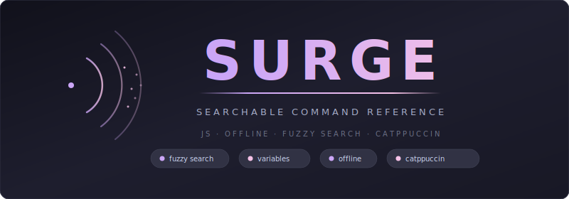
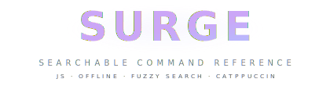

<div align="center">

<picture>
  <source media="(prefers-color-scheme: dark)" srcset="docs/assets/banner-dark.svg">
  <source media="(prefers-color-scheme: light)" srcset="docs/assets/banner-light.svg">
  
</picture>

Static web app that transforms markdown notes into a searchable, offline-first command reference — fuzzy search, variable substitution, and Catppuccin themes.

[](LICENSE)
[](#tech-stack)
[](#features)
[](https://github.com/catppuccin)

</div>

---

## Table of Contents

- [Highlights](#highlights)
- [Quick Start](#quick-start)
- [Architecture](#architecture)
- [Tech Stack](#tech-stack)
- [Features](#features)
- [Configuration](#configuration)
- [Reference Format](#reference-format)
- [Contributing](#contributing)
- [License](#license)

---

## Highlights

<table>
<tr>
<td width="50%">

### Instant Fuzzy Search

Search across titles, categories, tags, notes, and commands with real-time results powered by Fuse.js.

</td>
<td width="50%">

### Variable System

Define `<variables>` in commands. Workspace support lets you save different variable sets per environment.

</td>
</tr>
<tr>
<td width="50%">

### Four Catppuccin Themes

Mocha (default), Macchiato, Frappe, and Latte. Click the title to cycle. Preference saved in localStorage.

</td>
<td width="50%">

### Offline Support

Full functionality without internet after first visit via service worker. All assets bundled locally.

</td>
</tr>
<tr>
<td width="50%">

### Obsidian Compatible

Standard markdown with YAML frontmatter, inline tags, and callout syntax. Edit in Obsidian, view in Surge.

</td>
<td width="50%">

### Keyboard Driven

Full keyboard navigation with arrow keys, Enter to expand, `c` to copy, `v` for variables, `w` for wrap, Esc to clear.

</td>
</tr>
<tr>
<td width="50%">

### One-Click Copy

Copy individual commands or entire procedures. Variables are automatically substituted with your current values.

</td>
<td width="50%">

### Smart Filtering

Toggle visibility of procedures by custom tags. Filter state persists across sessions.

</td>
</tr>
</table>

---

## Quick Start

**Prerequisites**

| Requirement | Version |
|-------------|---------|
| Python | 3.7+ |
| Browser | Chrome, Firefox, Safari, Edge |

**Install**

```bash
git clone https://github.com/Real-Fruit-Snacks/Surge.git
cd Surge
```

**Development**

```bash
# Build search index
python3 build.py

# Start local server
python3 -m http.server 8080 --directory site

# Open browser
# http://localhost:8080
```

---

## Architecture

Surge uses a build-time parser to convert markdown notes into a searchable JSON index. The frontend is a vanilla JavaScript single-page app with fuzzy search, variable substitution, and offline support via service worker.

```
surge/
├── notes/                    # Markdown references (Obsidian vault compatible)
│   ├── *.md                  # Draft notes (ignored by build and git)
│   ├── _Archive/             # Archived notes (ignored by build)
│   └── {Category}/           # Organized by topic
├── site/                     # Static web application
│   ├── index.html            # Single-page shell
│   ├── app.js                # Application logic (~1500 lines)
│   ├── config.js             # Filter configuration (edit this!)
│   ├── styles.css            # Catppuccin themes + styling
│   ├── commands.json         # Generated search index (gitignored)
│   ├── sw.js                 # Service worker for offline support
│   └── vendor/               # Bundled dependencies (Fuse.js, Highlight.js)
├── build.py                  # Markdown parser and index generator
└── .github/workflows/        # GitHub Pages deployment
```

---

## Tech Stack

| Layer | Technology |
|-------|------------|
| Search | Fuse.js 6.6.2 (fuzzy matching) |
| Syntax Highlighting | Highlight.js 11.8.0 |
| Build | Python 3.7+ (standard library only) |
| Theming | Catppuccin via CSS custom properties |
| Offline | Service worker with static cache |
| Hosting | Any static file server (GitHub Pages, GitLab, nginx) |

---

## Features

| Feature | Description |
|---------|-------------|
| Fuzzy search | Real-time search across titles, categories, tags, and commands |
| Variable substitution | `<var>` syntax with workspace support for different environments |
| Workspaces | Save variable sets per environment (Lab, Production, etc.) |
| Copy with substitution | One-click copy replaces variables with current values |
| Four Catppuccin themes | Mocha, Macchiato, Frappe, Latte — click title to cycle |
| Offline support | Service worker caches everything for full offline use |
| Keyboard navigation | Arrow keys, Enter, c/w/v/Esc shortcuts for power users |
| Tag filtering | Toggle procedure visibility by custom tags |
| Obsidian compatible | YAML frontmatter, inline tags, callout syntax |
| Syntax highlighting | Bash, PowerShell, Python, and more via Highlight.js |
| Code wrapping | Toggle line wrapping on code blocks with `w` key |
| History panel | Track recently viewed procedures |
| Analyzer panel | Character analysis and MD5 hashing |
| Zero dependencies | No CDN, no runtime deps — everything bundled |

---

## Configuration

Customize Surge by editing `site/config.js`. This controls which tags can be filtered in the UI.

**Example configuration:**

```javascript
const TOGGLES = [
  { tag: 'Draft', label: 'Drafts', default: false },      // Hidden by default
  { tag: 'Reference', label: 'Reference', default: true }, // Visible by default
  { tag: 'Lab', label: 'Lab Notes', default: false },
];
```

Tag procedures in YAML frontmatter:

```yaml
---
tags:
  - Draft
  - Linux
---
```

The Filters dropdown will show toggles for each configured tag. Procedures with disabled filter tags are hidden from search results.

---

## Reference Format

Surge uses standard markdown with special conventions:

- `## H2` creates a procedure (main searchable card)
- `### H3` creates a step within a procedure
- Code blocks are syntax-highlighted and copyable
- `<variables>` in code blocks are highlighted and substitutable
- `> blockquote` creates styled notes
- `> [!warning]` creates Obsidian-style callouts

**Example:**

````markdown
---
tags: [networking, linux]
---

# Network Configuration

## SSH Connection Setup

> [!info] Standard SSH connection with port forwarding.

### Connect to Remote Host

```bash
ssh <user>@<remote_host> -p <port>
```

### Setup Port Forward [optional]

```bash
ssh -L <local_port>:localhost:<remote_port> <user>@<remote_host>
```
````

This creates a searchable procedure with two steps. The `[optional]` flag excludes the second step from "Copy All".

---

## Contributing

See [CONTRIBUTING.md](CONTRIBUTING.md) for guidelines on adding references, submitting code changes, and the pull request process.

## License

[MIT](LICENSE)

---

<div align="center">

<picture>
  <source media="(prefers-color-scheme: dark)" srcset="docs/assets/logo-dark.svg">
  <source media="(prefers-color-scheme: light)" srcset="docs/assets/logo-light.svg">
  
</picture>

**Surge** — searchable command reference

[Report Issue](https://github.com/Real-Fruit-Snacks/Surge/issues) · [Request Feature](https://github.com/Real-Fruit-Snacks/Surge/issues)

</div>
